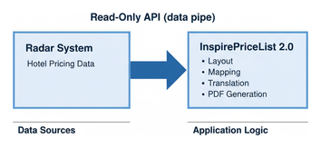

## Proposed Price List Workflow

InspirePriceList 1.0.4 is a small desktop tool that edits prices directly inside the Inspire PDF price lists without changing layout, fonts, or formatting. You open the PDF, change the numbers. It's being used in Bloomington, Minnesota.

InspirePriceList 2.0 proposes to automate price sheet generation while minimizing any changes to Radar. PDF generation lives in InspirePriceList, not Radar. Radar manages hotel pricing; InspirePriceList generates price sheets. They serve different purposes and should remain separate.

The proposed connection is a read-only API that acts as a data pipe. This design enables InspirePriceList to evolve independently, on its own release cycle, without touching Radar.

Radar descriptions don't always match what needs to appear on a price sheet, and that translation logic does not belong in Radar. InspirePriceList owns the layout, the mapping, and the PDF generation. Radar owns the prices.

## Support for a Modular Design

InspirePriceList was developed using AI-assisted tooling, reducing a four-week effort to approximately four days. Independent research shows these tools are most effective when systems are modular and clearly bounded. Reflecting this shift at scale, Microsoft CEO Satya Nadella stated in April 2025 that roughly 20–30% of Microsoft’s code is now generated by AI, demonstrating that AI-assisted development is already embedded in large, production software organizations.
https://www.businessinsider.com/ai-code-meta-microsoft-google-llamacon-engineers-2025-4

 The MASAI framework demonstrates higher success rates when AI-assisted work is broken into small, self-contained components with explicit interfaces.
https://arxiv.org/abs/2406.11638